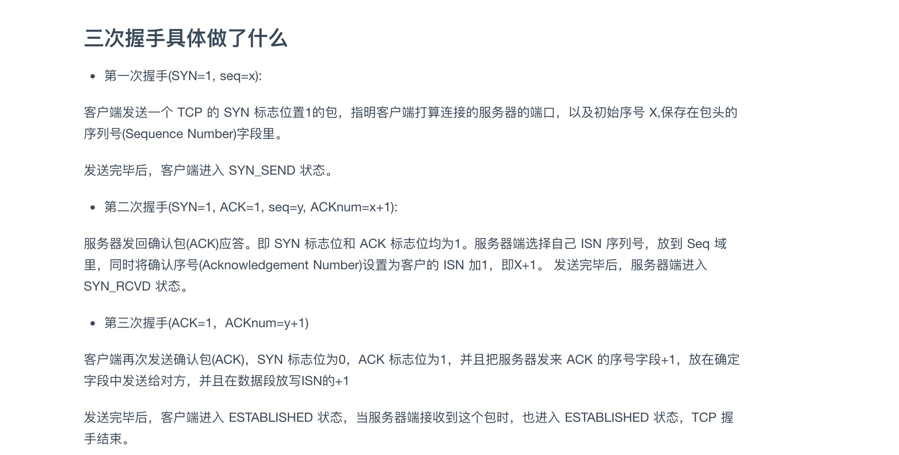

## [一个页面从输入url到页面加载完成，这个过程发生了什么](https://blog.csdn.net/wang_liuyong/article/details/81540175)

js html是基于http在浏览器和服务器之间进行传输（是响应的第四部分的字符串）  
1. http协议基于TCP/IP协议  
过程：浏览器输入域名 -> 浏览器查询dns是否有缓存 -> DNS查询到域名 -> TCP/IP链接（三次握手）-> 建立连接 -> 浏览器发出请求 -> 服务器响应（1.2.3.4）-> 浏览器会先获得响应头然后在获得相应体（因为响应体有时候会很大）.
```
1. 浏览器地址栏输入url

2. 浏览器会先查看浏览器缓存--系统缓存--路由缓存，如有存在缓存，就直接显示。如果没有，接着第三步

3. 域名解析（DNS）获取相应的ip

4. 浏览器向服务器发起tcp连接，与浏览器建立tcp三次握手

5. 握手成功，浏览器向服务器发送http请求，请求数据包

6. 服务器请求数据，将数据返回到浏览器

7. 浏览器接收响应，读取页面内容，解析html源码，生成DOm树

8. 解析css样式、浏览器渲染，js交互绑定多个域名，数量不限
```
---
1. 浏览器的地址栏输入URL并按下回车。
2. 浏览器查找当前URL是否存在缓存，并比较缓存是否过期。
3. DNS解析URL对应的IP。
4. 根据IP建立TCP连接（三次握手）。
5. HTTP发起请求。
6. 服务器处理请求，浏览器接收HTTP响应。
7. 渲染页面，构建DOM树。
8. 关闭TCP连接（四次挥手）。

---
## 三次握手
知道了服务器的 IP 地址，下面便开始与服务器建立连接了。

通俗地讲，通信连接的建立需要经历以下三个过程：

主机向服务器发送一个建立连接的请求（您好，我想认识您）；

服务器接到请求后发送同意连接的信号（好的，很高兴认识您）；

主机接到同意连接的信号后，再次向服务器发送了确认信号（我也很高兴认识您），自此，主机与服务器两者建立了连接。

**补充说明：**
```
TCP 协议：三次握手的过程采用 TCP 协议，其可以保证信息传输的可靠性，三次握手过程中，若一方收不到确认信号，协议会要求重新发送信号。

网页请求与显示 
当服务器与主机建立了连接之后，下面主机便与服务器进行通信。网页请求是一个单向请求的过程，即是一个主机向服务器请求数据，服务器返回相应的数据的过程。

浏览器根据 URL 内容生成 HTTP 请求，请求中包含请求文件的位置、请求文件的方式等等；

服务器接到请求后，会根据 HTTP 请求中的内容来决定如何获取相应的 HTML 文件；

服务器将得到的 HTML 文件发送给浏览器；

在浏览器还没有完全接收 HTML 文件时便开始渲染、显示网页；

在执行 HTML 中代码时，根据需要，浏览器会继续请求图片、CSS、JavsScript等文件，过程同请求 HTML ；
```
## 四次挥手
主机向服务器发送一个断开连接的请求（不早了，我该走了）；

服务器接到请求后发送确认收到请求的信号（知道了）；

服务器向主机发送断开通知（我也该走了）；

主机接到断开通知后断开连接并反馈一个确认信号（嗯，好的），服务器收到确认信号后断开连接；

**补充说明：**
```
为什么服务器在接到断开请求时不立即同意断开：当服务器收到断开连接的请求时，可能仍然有数据未发送完毕，所以服务器先发送确认信号，等所有数据发送完毕后再同意断开。

第四次握手后，主机发送确认信号后并没有立即断开连接，而是等待了 2 个报文传送周期，原因是：如果第四次握手的确认信息丢失，服务器将会重新发送第三次握手的断开连接的信号，而服务器发觉丢包与重新发送的断开连接到达主机的时间正好为 2 个报文传输周期。
```




